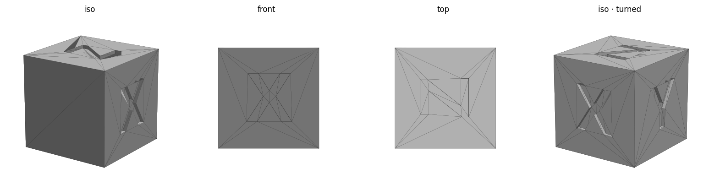

# 3D Printer Models

Parametric [OpenSCAD](https://openscad.org/) models with a small Python toolchain that
exports each one to a print-ready `.3mf` for [Bambu Studio](https://bambulab.com/) and
verifies the mesh before printing. Target printer: Bambu Lab A1.

## Designs

| | | |
|---|---|---|
| **Buckyball (C60)** — open wireframe truncated icosahedron (60 vertices, 90 struts, 12 pentagons + 20 hexagons). Seats on a hexagonal face for brim-free printing. |  | [`buckyball/`](buckyball/) |
| **XYZ calibration cube** — 20 mm cube with X/Y/Z carved into three faces, for checking dimensional accuracy. |  | [`xyz_calibration_cube/`](xyz_calibration_cube/) |

## Layout

```
tools/        shared, model-agnostic scripts (preview, stl->3mf, verify, preflight)
<design>/     one folder per object: <name>.scad (source) + generated .stl/.3mf/.png
              + check.sh (pre-print safety check) + PRINT_NOTES.md (settings & safety)
```

## Workflow

Each object is one self-contained parametric `.scad`. From inside a design folder:

```bash
openscad -o buckyball.stl buckyball.scad                            # render mesh (CGAL)
python ../tools/preview.py buckyball.stl                            # multi-angle preview PNG
python ../tools/stl_to_3mf.py buckyball.stl buckyball.3mf           # pack for Bambu Studio
./check.sh                                                          # verify mesh + safety preflight
```

`check.sh` validates the mesh (watertight, consistent winding, round-trip vs the STL),
reports the size and first-layer footprint, and prints safety reminders. Read
`PRINT_NOTES.md` in each folder for that design's slicer settings.

Requires OpenSCAD and Python with `numpy` + `matplotlib`.
