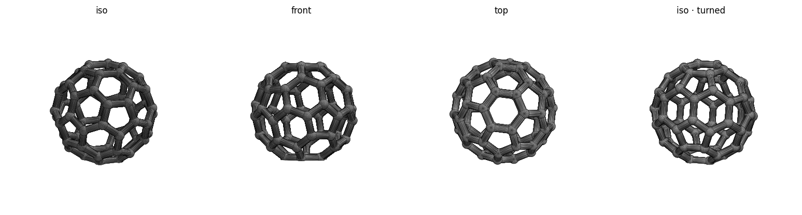

# Buckyball (C60) — print notes

Open wireframe truncated icosahedron: **60 vertices, 90 edges, 32 faces** (12 pentagons +
20 hexagons). Printed as the bond skeleton — 90 struts joined by 60 ball-nodes — so the
faces stay see-through. Black filament.



## At a glance
| | |
|---|---|
| Outer size | ~54.7 × 53.9 × 49.2 mm |
| Strut / node | 3.5 mm / 5.0 mm |
| Material | ~8.6 cm³ ≈ **~10 g PLA** (rough) |
| Seats on | a hexagonal face (1.5 mm flat) → **202 mm² footprint** |

## Before printing — run the safety check
```bash
./check.sh        # verifies the mesh and prints size, footprint, and reminders
```
Then read the settings below. Do **not** print if `check.sh` reports a mesh FAIL.

## Slicer settings (Bambu Studio, Bambu Lab A1)
- **Filament:** black PLA. **Layer height:** 0.2 mm. **Walls:** 2–3.
- **Brim: NONE.** It rests on a flat hexagonal face — the 202 mm² footprint holds on its own.
- **Supports: optional.** Tree supports (auto) make the lower mid-body struts a little
  crisper, but are not needed for adhesion. The open faces let you reach in to remove them.
- Drop on the plate as-is; it self-seats on the flat bottom.

## Safety checklist
**Operation**
- [ ] Room ventilated (molten plastic gives off fumes — PLA mild, still ventilate)
- [ ] Aware the nozzle (~200 °C) and bed (~60 °C) are hot — don't touch during/after
- [ ] Printer will **not** be left unattended (fire risk)
- [ ] Watching the **first layer** — if the hexagon base doesn't stick, cancel and re-level / clean the plate

**Mesh / design**
- [ ] `check.sh` reports watertight ✓ and VALID
- [ ] Bounding box matches the intended size (~55 mm)
- [ ] Footprint ≥ ~80 mm² (it's ~202) so no brim is needed

## Re-tuning / regenerating
Edit the parameters at the top of `buckyball.scad` (`diameter`, `strut_d`, `joint_d`,
`flat`, `hex_down`), then from this folder:
```bash
openscad -o buckyball.stl buckyball.scad                 # ~3 min (CGAL)
/opt/anaconda3/bin/python ../tools/preview.py buckyball.stl
/opt/anaconda3/bin/python ../tools/stl_to_3mf.py buckyball.stl buckyball.3mf
./check.sh
```
Keep `joint_d` clearly larger than `strut_d` (≈ +1 mm) or the mesh develops non-manifold
junctions — see the project `CLAUDE.md`.
