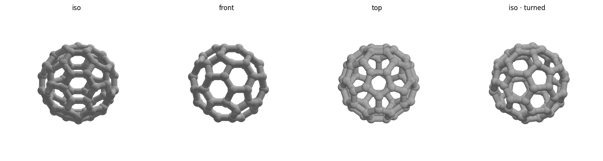

# Buckyball (C60) — pure ball-and-stick, 60 mm — print notes

The 60 mm edition of the **perfectly symmetric** one: 60 sphere joints + 90 cylinder
struts (12 pentagons + 20 hexagons stay see-through), with **nothing flattened, clipped,
or fused anywhere** — fully icosahedrally symmetric as printed, like a molecular model.
Identical to `../ball-and-stick/` except `diameter = 60` (strut/ball sizes unchanged, so
it reads slightly chunkier). It rests on the plate on the 5 bottom balls of a pentagon
face; adhesion comes from a **slicer brim added in Bambu Studio** (`brim_d=0` in the
scad; set it `>0` to bring back the modeled-in brim).



## At a glance
| | |
|---|---|
| Outer size | ~66 × 65 × 63 mm (60 mm across the vertices) |
| Strut / ball | 5.0 mm / 7.5 mm |
| Seats on | the 5 bottom balls of a pentagon face (~point contact) — **slicer brim required** |
| Symmetry | full icosahedral, as printed |

## Before printing — run the safety check
```bash
./check.sh        # verifies the mesh and prints size, footprint, and reminders
```
Then read the settings below. Do **not** print if `check.sh` reports a mesh FAIL.

## Slicer settings (Bambu Studio, Bambu Lab A1)
**Shortcut: open `buckyball_print.3mf`** — a ready-made Bambu project with everything
below already set (A1 0.4 nozzle, Bambu PLA Basic, 0.20 mm Standard, textured PEI,
outer brim 8 mm with 0.1 mm gap, tree supports). Regenerate it with
`/opt/anaconda3/bin/python ../../tools/bambu_print_3mf.py buckyball.3mf buckyball_print.3mf`.
Opening the plain `buckyball.3mf` instead needs the settings set by hand:

- **Filament:** PLA. **Layer height:** 0.2 mm. **Walls:** 2–3, no infill needed
  (struts print as perimeters).
- **Brim: enable in the slicer** — *Others → Brim type: outer brim*, width ~8 mm,
  **brim–object gap 0.1 mm**. The 5 bottom balls each touch the plate in a ~1 mm dot;
  the gapped brim anchors those dots and releases cleanly instead of tearing.
- **Supports: ON, tree (auto).** With no flat anywhere, the lower-hemisphere struts and
  ball undersides all overhang; tree supports are required. The open faces let you reach
  in to remove them.
- Drop on the plate as-is; the bottom balls sit at z = 0.

## After printing
1. Pop the slicer brim off (the 0.1 mm gap means it isn't fused to the balls — run a
   blade around it if it resists; don't pull upward on the cage).
2. If the ball contact dots show any brim residue, a light sanding restores them.

## Safety checklist
**Operation**
- [ ] Room ventilated (molten plastic gives off fumes — PLA mild, still ventilate)
- [ ] Aware the nozzle (~200 °C) and bed (~60 °C) are hot — don't touch during/after
- [ ] Printer will **not** be left unattended (fire risk)
- [ ] Watching the **first layer** — if the brim doesn't stick, cancel and re-level /
      clean the plate

**Mesh / design**
- [ ] `check.sh` reports watertight ✓ and VALID
- [ ] Bounding box matches the intended size (~65 mm)
- [ ] Tree supports **and** slicer brim enabled (only 5 tiny ball dots touch the plate)

## Re-tuning / regenerating
Edit the parameters at the top of `buckyball.scad` (`diameter`, `strut_d`, `joint_d`,
`brim_d`, `brim_h`, `bite`), then from this folder:
```bash
openscad -o buckyball.stl buckyball.scad                 # ~3 min (CGAL)
/opt/anaconda3/bin/python ../../tools/preview.py buckyball.stl
/opt/anaconda3/bin/python ../../tools/stl_to_3mf.py buckyball.stl buckyball.3mf
./check.sh
```
Keep `joint_d` clearly larger than `strut_d` (≈ +1 mm or more) or the mesh develops
non-manifold junctions — see the project `CLAUDE.md`. Keep `bite` well inside
`brim_h` (transversal intersections, no tangent grazing).
