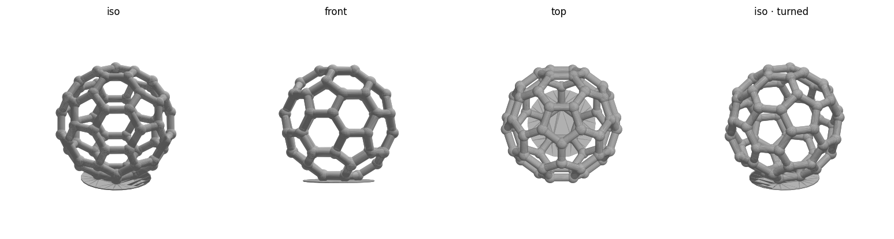

# Buckyball (C60) — pure ball-and-stick — print notes

The **perfectly symmetric** one: 60 sphere joints + 90 cylinder struts (12 pentagons +
20 hexagons stay see-through), with **nothing flattened or clipped anywhere**. It is held
on the plate only by a thin **modeled-in brim** the 5 bottom balls sink 0.45 mm into.
Snip/peel the brim off after printing and sand the 5 tiny witness dots — the ball is
then fully icosahedrally symmetric, like a molecular model.



## At a glance
| | |
|---|---|
| Outer size | ~81 × 80 × 78 mm (75 mm across the vertices) |
| Strut / ball | 5.0 mm / 7.5 mm |
| Seats on | a Ø48 × 0.6 mm brim disc (≈1789 mm² footprint) — snip off after |
| Symmetry | full icosahedral once the brim is removed |

## Before printing — run the safety check
```bash
./check.sh        # verifies the mesh and prints size, footprint, and reminders
```
Then read the settings below. Do **not** print if `check.sh` reports a mesh FAIL.

## Slicer settings (Bambu Studio, Bambu Lab A1)
- **Filament:** PLA. **Layer height:** 0.2 mm. **Walls:** 2–3, no infill needed
  (struts print as perimeters).
- **Brim: built into the model.** The Ø48 mm disc *is* the brim — don't add another.
- **Supports: ON, tree (auto).** With no flat anywhere, the lower-hemisphere struts and
  ball undersides all overhang; tree supports are required. The open faces let you reach
  in to remove them.
- Drop on the plate as-is; the brim disc sits at z = 0.

## After printing
1. Peel/snip the brim disc off (it is only ~3 layers thick — flush cutters at the 5
   fused patches, then it pops free).
2. Sand the 5 small witness dots on the bottom balls smooth.

## Safety checklist
**Operation**
- [ ] Room ventilated (molten plastic gives off fumes — PLA mild, still ventilate)
- [ ] Aware the nozzle (~200 °C) and bed (~60 °C) are hot — don't touch during/after
- [ ] Printer will **not** be left unattended (fire risk)
- [ ] Watching the **first layer** — if the brim doesn't stick, cancel and re-level /
      clean the plate

**Mesh / design**
- [ ] `check.sh` reports watertight ✓ and VALID
- [ ] Bounding box matches the intended size (~80 mm)
- [ ] Tree supports enabled (nothing but the brim touches the plate)

## Re-tuning / regenerating
Edit the parameters at the top of `buckyball.scad` (`diameter`, `strut_d`, `joint_d`,
`brim_d`, `brim_h`, `bite`), then from this folder:
```bash
openscad -o buckyball.stl buckyball.scad                 # ~3 min (CGAL)
/opt/anaconda3/bin/python ../../tools/preview.py buckyball.stl
/opt/anaconda3/bin/python ../../tools/stl_to_3mf.py buckyball.stl buckyball.3mf
./check.sh
```
Keep `joint_d` clearly larger than `strut_d` (≈ +1 mm or more) or the mesh develops
non-manifold junctions — see the project `CLAUDE.md`. Keep `bite` well inside
`brim_h` (transversal intersections, no tangent grazing).
