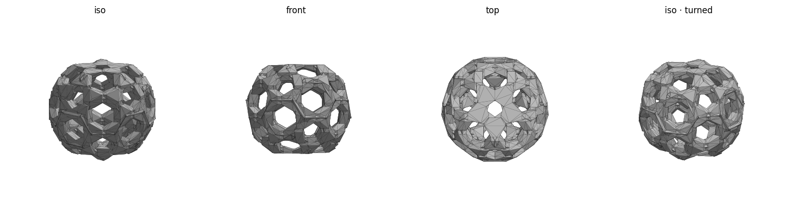

# Buckyball (C60) — edges-only — print notes

Minimal **edge frame**: the 90 edges as simple square-section beams that fuse directly at
the vertices in small flat-faceted nodes (**no ball-joint spheres**). Pentagon-seated
(5-fold) with matching flats top & bottom, so it's mirror-symmetric and sits level.



## At a glance
| | |
|---|---|
| Outer size | ~54.6 × 53.9 × 45.0 mm |
| Beams | square, 4 mm across; faceted nodes (no spheres) |
| Seats on | a pentagon face → **387 mm² footprint** |

## Before printing
```bash
./check.sh        # watertight ✓, size, footprint, safety reminders
```

## Slicer settings (Bambu Studio, Bambu Lab A1)
- Black PLA, 0.2 mm layers, 2–3 walls.
- **Brim: none** (387 mm² footprint holds on its own).
- **Supports: optional** tree supports for the lower struts; not needed for adhesion.

## Note
A pure edge frame (beams meeting at bare points) is non-manifold in OpenSCAD, so the beams
fuse in a minimal flat-faceted node (`node_k`). Keep `node_k` ≈ 1.4 — smaller re-introduces
non-manifold junctions (the mesh is sensitive; re-run `./check.sh` after any change).
