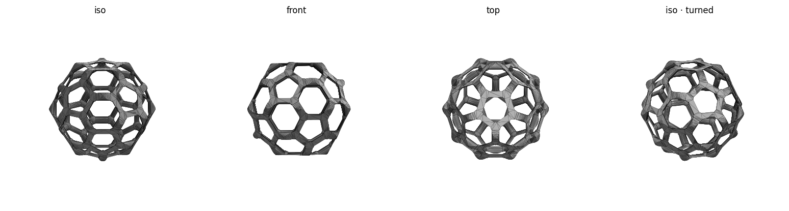

# Buckyball (C60) — symmetric-flats — print notes

Round-strut wireframe truncated icosahedron, **maximally symmetric**: seated on a
pentagon (5-fold axis) and clipped on **all 12 pentagon faces by the same amount**,
so every pentagon is identical and the ball sits the same way on any of its 12 faces
(full icosahedral symmetry). 60 vertices, 90 struts, 12 pentagons + 20 hexagons.



## At a glance
| | |
|---|---|
| Outer size | ~52.5 × 50.2 × 45.0 mm |
| Strut / node | 3.5 mm / 5.0 mm ball-joints |
| Symmetry | full icosahedral — 12 identical pentagon flats |
| Seats on | any pentagon face → **203 mm² footprint** |

## Before printing — run the safety check
```bash
./check.sh        # verifies the mesh and prints size, footprint, and reminders
```
Do **not** print if `check.sh` reports a mesh FAIL.

## Slicer settings (Bambu Studio, Bambu Lab A1)
- **Filament:** black PLA. **Layer height:** 0.2 mm. **Walls:** 2–3.
- **Brim: none.** The 203 mm² pentagon footprint holds on its own (clean, level bed).
- **Supports: optional.** Lower struts overhang slightly; tree supports make them crisper
  but aren't needed for adhesion. Open faces let you reach in to remove them.
- Drop on the plate as-is — it self-seats on a flat pentagon face.

## Safety checklist
**Operation**
- [ ] Room ventilated (PLA fumes) · nozzle ~200 °C / bed ~60 °C are hot
- [ ] Printer **not** left unattended · watching the **first layer**

**Mesh / design**
- [ ] `check.sh` reports watertight ✓ and VALID
- [ ] Footprint ≥ ~80 mm² (it's ~203) so no brim is needed

## Re-tuning
Edit the top of `buckyball.scad` (`diameter`, `strut_d`, `joint_d`, `flat`), then:
```bash
openscad -o buckyball.stl buckyball.scad                  # ~3.5 min (CGAL)
/opt/anaconda3/bin/python ../../tools/preview.py buckyball.stl
/opt/anaconda3/bin/python ../../tools/stl_to_3mf.py buckyball.stl buckyball.3mf
./check.sh
```
Keep `flat` **small** (~1 mm): the cut must pass *through* the bottom pentagon's
horizontal struts to keep the wide footprint; larger values cut above them and the
footprint collapses (e.g. flat=3.5 → only 14 mm²).
