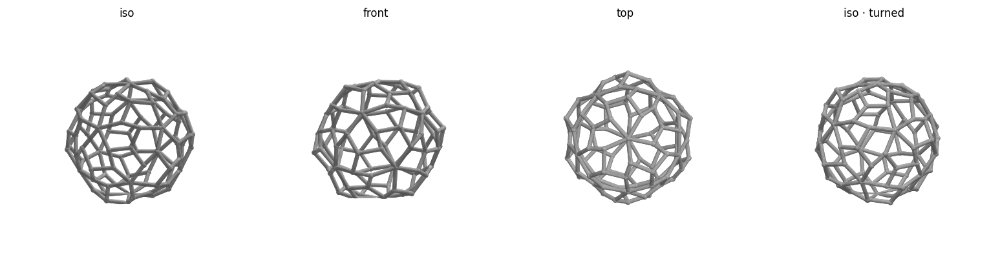

# Buckyball (C60) — Voronoi shell — print notes

A delicate, **icosahedrally-symmetric Voronoi** web on the truncated-icosahedron form.
One generic seed point is replicated by the 60 rotations of the buckyball's own symmetry
group, so the cell pattern is organic *and* fully symmetric (and aligned to the solid).
Each spherical-Voronoi edge is a thin rounded strut projected onto the C60 surface.



## At a glance
| | |
|---|---|
| Outer size | ~77 × 80 × 71 mm (75 mm across the vertices) |
| Pattern | 60 cells, 150 struts, 2.4 mm strut diameter |
| Symmetry | full icosahedral, aligned to the C60 |
| Footprint | ~167 mm² — solid base |

Size is set by `DIAM` at the top of `gen.py` (`python gen.py 75`); strut/node/flat all
scale with it, so the footprint grows ~with size².

## How it's made (different from the OpenSCAD models)
This shape needs computational geometry, so its **source is `gen.py`** (Python:
`scipy` Voronoi + `trimesh`/`manifold3d` for fast watertight booleans), which writes
`buckyball.stl` **and** `buckyball.3mf` directly. To regenerate / re-tune:
```bash
/opt/anaconda3/bin/python gen.py [flat_mm]      # e.g. gen.py 1.5
./check.sh
```
Knobs at the top of `gen.py`: `STRUT_D` (delicacy), `SEED` (changes the cell pattern),
`FLAT` (base). For a **finer** web, replicate 2 seeds (≈120 cells); for **coarser**, put
the seed on a symmetry axis.

## Before printing — run the safety check
```bash
./check.sh        # verifies the mesh; prints size, footprint, reminders
```

## Slicer settings (Bambu Studio, Bambu Lab A1) — this one needs support
- **Filament:** black PLA. **Layer height:** 0.16–0.20 mm. **Walls:** the 1.6 mm struts
  print as a few perimeters — no infill needed.
- **Supports: ON, tree (auto).** A thin spherical web has overhangs all over the lower
  hemisphere; tree supports are needed for a clean result. The open cells make them
  reachable for removal.
- **Brim: optional.** The footprint is now ~167 mm² (solid), so a brim is no longer
  required — add a small one only if you want extra insurance.
- Drop on the plate as-is (it has a flat bottom from `FLAT`).

## Safety checklist
**Operation**
- [ ] Room ventilated (PLA fumes) · nozzle ~200 °C / bed ~60 °C are hot
- [ ] Printer **not** left unattended · watching the **first layer**
- [ ] Removing tree supports gently — the struts are delicate

**Mesh / design**
- [ ] `check.sh` reports watertight ✓ and VALID
- [ ] Supports + brim enabled (small footprint, overhangs)
