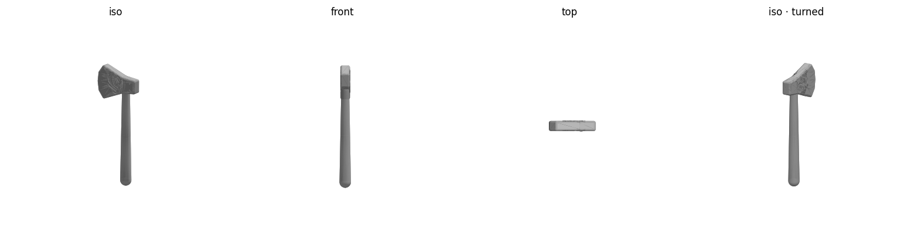
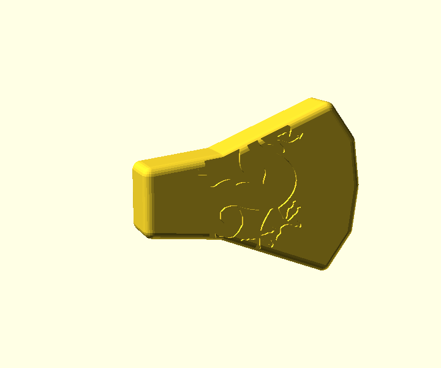
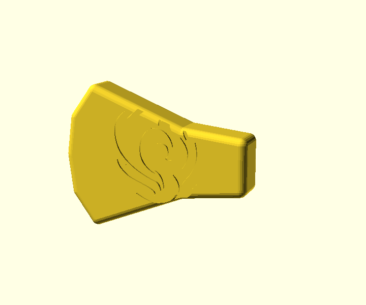

# 龙凤斧 Dragon-and-Phoenix Axe — print notes

A ~281 mm single-bit toy hatchet for a young child. One cheek of the head carries a
**dragon (龙)**, the other a **phoenix (凤)**, recessed ~1.2 mm. Prints as two parts —
**head + handle** — joined by a glued hex tenon.



| dragon cheek | phoenix cheek |
|---|---|
|  |  |

## At a glance
| | |
|---|---|
| Total length | ~281 mm (head ~78 mm tall + handle ~247 mm) |
| Head | blunt, fully-rounded, 22 mm thick; dragon/phoenix engraved ~1.2 mm |
| Handle | round grip ~22 mm, end-knob ~26 mm, hex tenon |
| Join | 12 mm hex tenon → head throat socket, 0.2 mm clearance, **glued** |
| Material | PLA |
| Head bbox | 102.9 × 21.9 × 78.2 mm |
| Handle bbox | 26.0 × 26.0 × 246.9 mm |

## Before printing — run the safety check
```bash
./check.sh        # preflights BOTH parts; do not print on a mesh FAIL
```
Both parts report a **tiny first-layer footprint** — that's expected (they stand on small
faces). The slicer brim below handles adhesion; don't add a modeled-in brim.

## Slicer settings (Bambu Studio, Bambu Lab A1, PLA)
Open the print-ready projects (already preset with an outer brim 8 mm / 0.1 mm gap + tree
supports): `dragon_phoenix_axe_head_print.3mf`, `dragon_phoenix_axe_handle_print.3mf`.
- **Layer height:** 0.2 mm. **Walls:** 3. **Infill:** 10–15 % (keep it light — it's swung).
- **Head orientation — important:** stand the head so **both cheeks are vertical** (rotate it
  off the auto-arranged flat-on-cheek pose). That prints both engravings at equal quality.
  Leave tree supports on for the toe overhang.
- **Handle orientation:** standing (vertical) prints support-free and fits the 256 mm bed.
  For a tougher handle, lay it horizontal with tree supports instead (stronger across the
  swing axis).

## Assembly
- Dry-fit the handle tenon into the head's bottom socket; it should slip in with light friction.
- Glue (cyanoacrylate or epoxy) and seat fully so the head sits flush. The hex flats keep the
  dragon/phoenix faces square to the blade. **Let it cure fully — this joint must not detach.**

## Safety checklist
**This is a child's toy**
- [ ] Cutting edge is blunt/rounded by design — confirm no sharp print artifacts; sand if needed
- [ ] Head is fully glued to the handle — **no detachable parts** (choking hazard)
- [ ] Light enough to swing safely (low infill)

**Operation**
- [ ] Room ventilated; nozzle/bed hot — don't touch; printer not left unattended; watch first layer

**Mesh / design**
- [ ] `./check.sh` reports watertight ✓ / VALID for both parts
- [ ] Head bbox ≈ 103 × 22 × 78 mm; handle ≈ 26 × 26 × 247 mm

## Relief art provenance & licence
Both are vector art from public sources, used here for a personal print. **If you distribute
or sell the model, review these licences first:**
- **Dragon** — "Dragon silhouette.svg" by *Angelus*, Wikimedia Commons,
  licensed **CC BY-SA 3.0** (requires attribution + share-alike). `art/dragon.svg`.
  <https://commons.wikimedia.org/wiki/File:Dragon_silhouette.svg>
- **Phoenix** — "mode-standard-phoenix" from SVG Repo (id 355420), `art/phoenix.svg`.
  **Licence not yet verified** — confirm at <https://www.svgrepo.com/svg/355420/> before any
  redistribution. Fine for personal use.

## Re-tuning / regenerating
Edit the parameters at the top of `dragon_phoenix_axe.scad` (e.g. `relief_dia`, `relief_x`,
`relief_z` to reposition/resize the engravings), then from this folder:
```bash
openscad -D 'part="head"'   -o dragon_phoenix_axe_head.stl   dragon_phoenix_axe.scad
openscad -D 'part="handle"' -o dragon_phoenix_axe_handle.stl dragon_phoenix_axe.scad
/opt/anaconda3/bin/python ../tools/preview.py dragon_phoenix_axe_head.stl
/opt/anaconda3/bin/python ../tools/stl_to_3mf.py dragon_phoenix_axe_head.stl dragon_phoenix_axe_head.3mf
./check.sh
```
To swap the art, replace `art/dragon.svg` / `art/phoenix.svg` with another bold, connected
silhouette and re-export (fine line-art won't survive the engraving).
