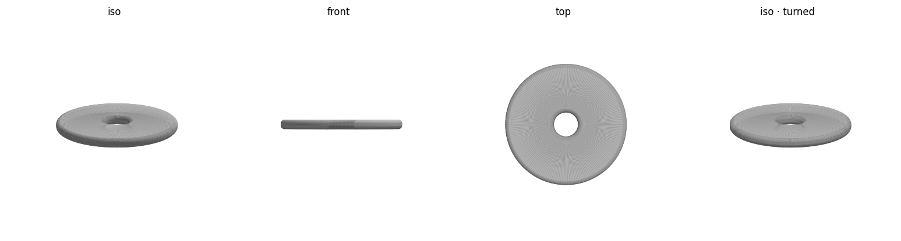

# 和氏璧 (Héshìbì) — print notes

A clean, minimalist ritual jade **璧 (bì)**: a flat annular disc with a small central hole,
fully symmetric and undecorated. The proportion follows the *Erya* definition of a true *bì* —
*肉倍好谓之璧* (the solid ring ≈ twice the hole), so the hole is **outer ⌀ / 5**. No rim, no
pattern, no text — just the silhouette and softly rounded edges.



## At a glance
| | |
|---|---|
| Outer diameter | 80 mm |
| Central hole | 16 mm (= outer/5, classical 璧 ratio) |
| Thickness | 6 mm |
| Edge | 2.5 mm rounded on outer + inner rims |
| Material | ~28 cm³ solid (much less with infill) |
| Seats on | a flat 80 mm annulus → **4213 mm² footprint** |

## Before printing — run the safety check
```bash
./check.sh        # verifies the mesh and prints size, footprint, and reminders
```
Do **not** print if `check.sh` reports a mesh FAIL.

## Slicer settings (Bambu Studio, Bambu Lab A1)
- **Filament:** PLA. **Layer height:** 0.2 mm. **Walls:** 2–3, **infill:** 15 %.
- **Brim: none, supports: none** — it's a solid disc resting on a large flat annulus; the
  first-layer contact is huge, so it needs no help sticking. (This is *not* a delicate part, so
  the repo's slicer-brim rule doesn't apply here.)
- Lies flat either way up — both faces are identical. A top cosmetic surface / ironing pass
  gives the flattest "polished jade" finish.

## What to check after printing
- Measure the outer diameter with calipers — should read **80.00 mm** (±0.1–0.2 mm typical).
- The central hole should be a clean **16 mm**; if it prints tight, it's the usual hole-shrinkage —
  nudge `hole_d` up ~0.3–0.4 mm and re-export, or use the slicer's hole-compensation.

## Safety checklist
**Operation**
- [ ] Room ventilated
- [ ] Nozzle (~200 °C) and bed (~60 °C) are hot — don't touch during/after
- [ ] Printer will **not** be left unattended
- [ ] Watching the **first layer**

**Mesh / design**
- [ ] `check.sh` reports watertight ✓ and VALID
- [ ] Bounding box reads 80 × 80 × 6 mm

## Re-tuning / regenerating
Edit `outer_d`, `hole_d`, `thickness`, or `edge_radius` at the top of `heshibi.scad`
(keep `edge_radius < thickness/2`), then from this folder:
```bash
openscad -o heshibi.stl heshibi.scad
/opt/anaconda3/bin/python ../tools/preview.py heshibi.stl
/opt/anaconda3/bin/python ../tools/stl_to_3mf.py heshibi.stl heshibi.3mf
./check.sh
```
